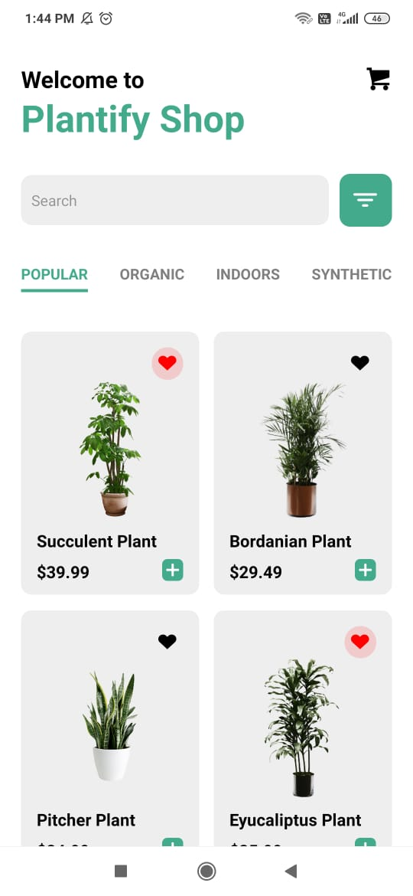
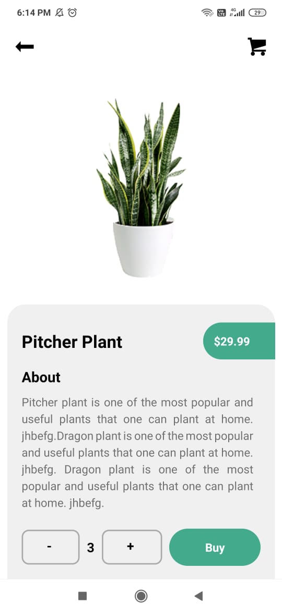

## Plantify- A shopping app made using React Native.

This is the UI prototype of Plantify- A shopping app made using React Native. This was me, first time using react-native. So, I decided to practice by creating a Plant-Selling App prototype.

## Prototype Images

**Plant List View/Home Screen**
{:height="500px"}

**Plant Details Screen**
{:height="400px"}

## Tech Stack Used
 
* [React Native](https://reactnative.dev/docs/getting-started "React Native") is used for creating the UI of the App.
    * [Expo](https://docs.expo.io/ "Expo") client is used for quick setting up of the App.
   
* [React Navigation - v5](https://reactnavigation.org/docs/getting-started "React Navigation - v5") is used for navigating between different screens.

## How to setup on local machine?

To setup this project on local machine:


* Fork this repository.

* Clone the repository using simple zip download or use the command
    ```
        git clone https://github.com/{Your-Username}/Plantify-ShoppingApp.git
    ```
    
* Install all the dependencies
    ```
       npm install
    ```
* For viewing the app
    ```
        npm start or
        expo start
    ```
Now, you can either use an emulator or expo client to view the app.